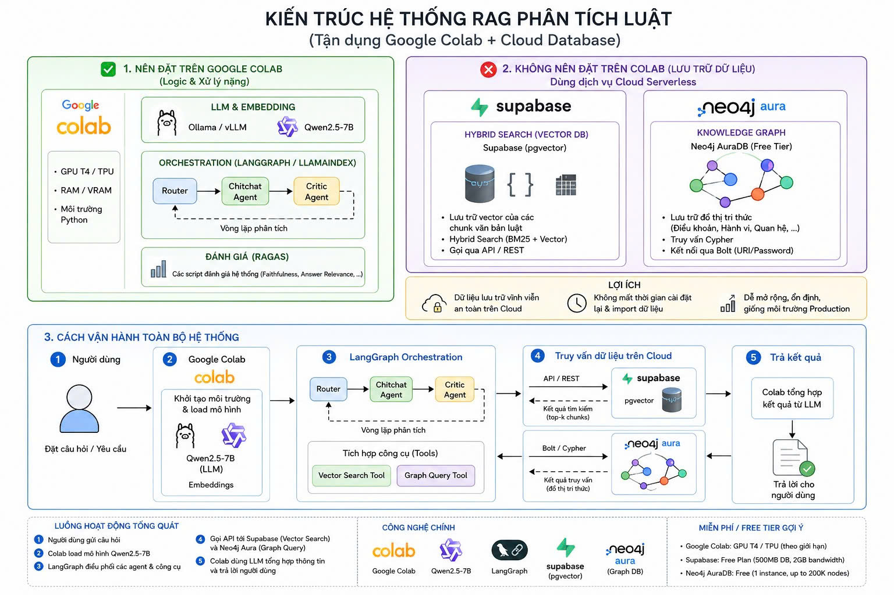
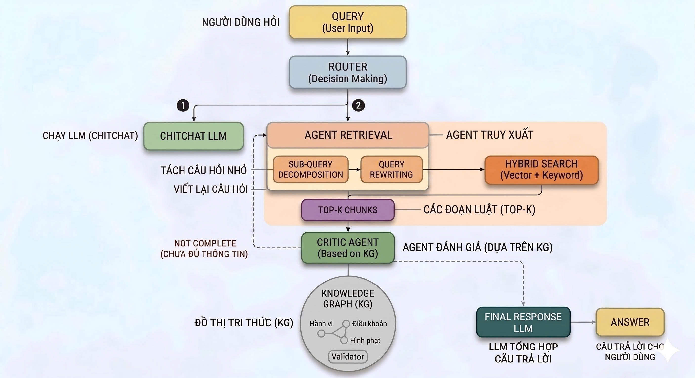

# LEGAL IT CHATBOT

Hệ thống RAG hỗ trợ tra cứu và phân tích văn bản pháp luật, tập trung chính vào lĩnh vực sở hữu trí tuệ. Ngoài ra, hệ thống mở rộng sang các lĩnh vực công nghệ thông tin có liên quan như an toàn thông tin, dữ liệu cá nhân, giao dịch điện tử, viễn thông và công nghiệp công nghệ số.

Project hiện tập trung vào phần nền tảng dữ liệu cho RAG:

- Chuẩn hóa và chia nhỏ văn bản pháp luật về sở hữu trí tuệ và công nghệ thông tin theo cấu trúc Điều - Khoản - Điểm.
- Tạo parent/child chunks để truy xuất đúng đoạn nhỏ nhưng vẫn khôi phục đầy đủ ngữ cảnh của Điều luật.
- Sinh embedding tiếng Việt bằng model finetune trong `references/`.
- Ingest dữ liệu vào Supabase `pgvector` hoặc Qdrant local.
- Kiểm thử truy xuất hybrid search từ Qdrant local hoặc vector search từ Supabase.

## Kiến trúc tổng quan



Hướng triển khai đề xuất:

- Google Colab xử lý logic nặng: load LLM, embedding model, agent orchestration và đánh giá.
- Supabase `pgvector` lưu trữ vector chunks và phục vụ hybrid/vector search.
- Neo4j AuraDB lưu knowledge graph cho quan hệ pháp lý như điều khoản, hành vi, chế tài, nghĩa vụ và ngoại lệ.
- Router/agent quyết định luồng xử lý: chitchat, retrieval, đánh giá đủ thông tin, tổng hợp câu trả lời.

## Luồng xử lý truy vấn



Luồng RAG mục tiêu:

1. Người dùng gửi câu hỏi pháp lý.
2. Router phân loại câu hỏi: hội thoại thông thường hoặc cần truy xuất luật.
3. Retrieval agent tách câu hỏi nhỏ, viết lại truy vấn và gọi hybrid search.
4. Vector database trả về top-k child chunks liên quan.
5. Hệ thống mở rộng child chunks sang parent chunks để lấy trọn ngữ cảnh Điều luật.
6. Critic agent kiểm tra độ đầy đủ dựa trên knowledge graph.
7. Final response LLM tổng hợp câu trả lời có căn cứ.

## Cấu trúc thư mục

```text
.
├── chunking.py                 # Chunker cho VBPL theo Điều/Khoản/Điểm
├── ingest_supabase.py          # Ingest parent/child chunks vào Supabase pgvector
├── bm25_sparse.py              # BM25 sparse encoder lưu cùng Qdrant local
├── embedding_model.py          # Resolve/extract/load embedding model finetune
├── qdrant_local_ingest.py      # Ingest parent/child chunks vào Qdrant local
├── qdrant_hybrid_search.py     # Kiểm thử hybrid search Qdrant: dense + BM25
├── supabase_schema.sql         # Schema bảng Supabase + pgvector index
├── test_supabase_search.py     # Script kiểm thử truy xuất vector từ Supabase
├── data/                       # Tập văn bản pháp luật đã tách keep/remove và bộ QA
└── docs/assets/                # Sơ đồ kiến trúc và luồng xử lý
```

## Dữ liệu

Thư mục `data/keep/` chứa văn bản nên ingest vào corpus chính. Thư mục `data/remove/` giữ văn bản hết hiệu lực, bị thay thế, trùng lặp hoặc không chính thức để tra cứu lịch sử. Các bộ câu hỏi đánh giá `.jsonl` vẫn nằm trong `data/`.

Lưu ý: chunker hiện chỉ xử lý file `.docx`. Các file `.pdf` đang được lưu như nguồn tài liệu gốc, chưa được parse trong pipeline hiện tại.

## Yêu cầu môi trường

- Python 3.10+
- Supabase project đã bật extension `pgvector` nếu dùng cloud vector database
- Hoặc Qdrant local nếu muốn chạy thử offline

Cài đặt thư viện:

```bash
python -m venv .venv
source .venv/bin/activate
pip install -r requirements.txt
pip install supabase
```

## Thiết lập Supabase

1. Tạo project Supabase.
2. Mở SQL Editor.
3. Chạy nội dung trong `supabase_schema.sql`.
4. Thiết lập biến môi trường:

```bash
export SUPABASE_URL="https://your-project.supabase.co"
export SUPABASE_SERVICE_KEY="your-service-role-key"
```

Để dùng `test_supabase_search.py`, cần có RPC `match_legal_child_chunks`. Có thể tạo thêm function sau trong Supabase SQL Editor:

```sql
create or replace function match_legal_child_chunks(
    query_embedding vector(1024),
    match_count int default 5
)
returns table (
    id text,
    dieu_id text,
    parent_id text,
    van_ban_id text,
    chunk_type text,
    content text,
    metadata jsonb,
    similarity float
)
language sql stable
as $$
    select
        c.id,
        c.dieu_id,
        c.parent_id,
        c.van_ban_id,
        c.chunk_type,
        c.content,
        c.metadata,
        1 - (c.embedding <=> query_embedding) as similarity
    from legal_child_chunks c
    where c.embedding is not null
    order by c.embedding <=> query_embedding
    limit match_count;
$$;
```

## Chạy chunking

Kiểm tra quá trình tách văn bản:

```bash
python chunking.py
```

Chunker tạo hai cấp dữ liệu:

- `children`: chunk nhỏ theo lời dẫn Điều, Khoản, Điểm.
- `parents`: chunk gộp theo từng Điều để giữ đầy đủ ngữ cảnh khi trả lời.

## Ingest vào Supabase

```bash
python ingest_supabase.py --data-dir data/keep --batch-size 200 --embed-batch-size 8
```

Các bảng được ghi:

- `legal_parent_chunks`: lưu parent chunks theo từng Điều.
- `legal_child_chunks`: lưu child chunks kèm embedding 1024 chiều.

## Ingest vào Qdrant local

```bash
python qdrant_local_ingest.py --data-dir data/keep --db-path data/.qdrant
```

Script tạo hai collection:

- `legal_child_chunks`: lưu child chunks với named vectors:
  - `dense`: embedding 1024 chiều từ model finetune.
  - `bm25`: sparse vector BM25 để keyword/legal citation matching.
- `legal_parent_chunks`: lưu parent chunks để mở rộng ngữ cảnh.

Nếu cần rebuild sạch collection cũ:

```bash
python qdrant_local_ingest.py \
  --data-dir data/keep \
  --db-path data/.qdrant \
  --recreate
```

Nếu chạy CPU-only và muốn rebuild nhanh hơn, có thể giới hạn số token model đọc mỗi child chunk:

```bash
python qdrant_local_ingest.py \
  --data-dir data/keep \
  --db-path data/.qdrant \
  --recreate \
  --max-seq-length 512
```

Mặc định script dùng model finetune tại:

```text
references/ai_vietnamese_embedding_v2_finetuned_final
```

Nếu thư mục model chưa được giải nén, script tự tìm và extract từ:

```text
references/ai_vietnamese_embedding_v2_finetuned_final (1).zip
```

Thư mục `data/.qdrant/` đã được đưa vào `.gitignore`.

## Kiểm thử hybrid search Qdrant local

```bash
python qdrant_hybrid_search.py \
  --db-path data/.qdrant \
  --query "Doanh nghiệp cần làm gì khi xử lý dữ liệu cá nhân?" \
  --limit 5 \
  --include-parent
```

Luồng retrieval:

1. Encode query bằng embedding finetune.
2. Encode query thành BM25 sparse vector từ index lưu trong `data/.qdrant/legal_child_chunks.bm25.json`.
3. Qdrant chạy song song dense search và BM25 sparse search trên child chunks.
4. Qdrant hợp nhất kết quả bằng RRF.
5. Script lấy `parent_id` từ child hits để trả về parent chunk đầy đủ ngữ cảnh Điều luật.

## Kiểm thử tìm kiếm Supabase

Chạy một truy vấn mẫu:

```bash
python test_supabase_search.py \
  --query "Doanh nghiệp cần làm gì khi xử lý dữ liệu cá nhân?" \
  --match-count 5 \
  --include-parent
```

Nếu không truyền `--query`, script sẽ chuyển sang chế độ nhập câu hỏi tương tác.

## Công nghệ chính

- Python
- `python-docx`
- `sentence-transformers`
- `AITeamVN/Vietnamese_Embedding_v2`
- Supabase `pgvector`
- Qdrant local

Các thành phần định hướng cho bản hoàn chỉnh:

- Qwen2.5-7B hoặc LLM tương đương
- LangGraph/LlamaIndex orchestration
- Neo4j AuraDB knowledge graph
- RAGAS hoặc bộ QA nội bộ để đánh giá chất lượng trả lời

## Trạng thái hiện tại

Đã có:

- Bộ dữ liệu văn bản pháp luật trong `data/`.
- Logic chunking parent/child cho văn bản `.docx`.
- Pipeline ingest Supabase.
- Pipeline ingest Qdrant local với dense embedding + BM25 sparse vector.
- Script kiểm thử hybrid search Qdrant local.
- Script kiểm thử vector search trên Supabase.
- Sơ đồ kiến trúc và luồng truy vấn.

Chưa có trong repo hiện tại:

- API/backend chatbot hoàn chỉnh.
- UI/frontend cho người dùng cuối.
- LangGraph agent runtime.
- Neo4j knowledge graph ingestion/query script.
- API/backend chatbot hoàn chỉnh dùng hybrid search trong runtime production.

## Bảo mật

Không commit các file sau:

- `.env`
- `.env.*`
- `.venv/`
- `data/.qdrant/`
- API keys, service role keys hoặc database passwords

Các mục trên đã được cấu hình trong `.gitignore`.
