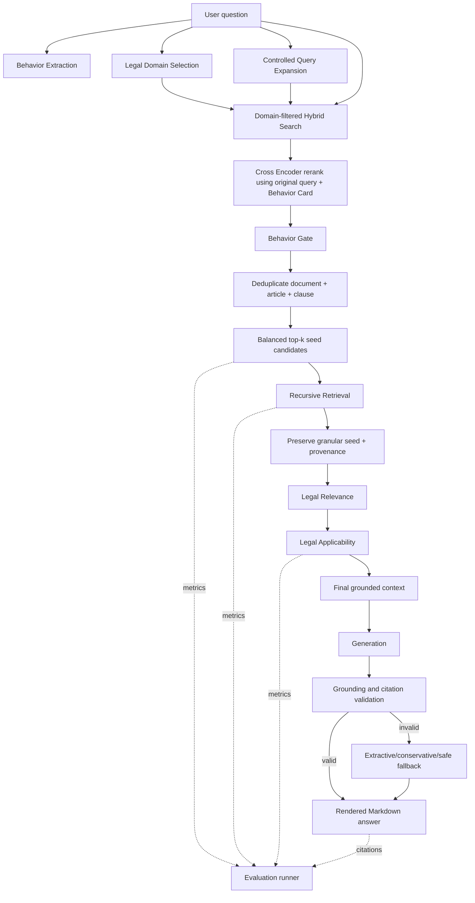
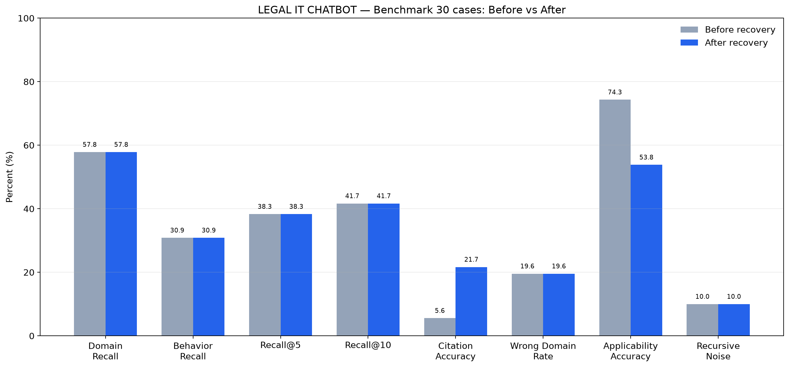
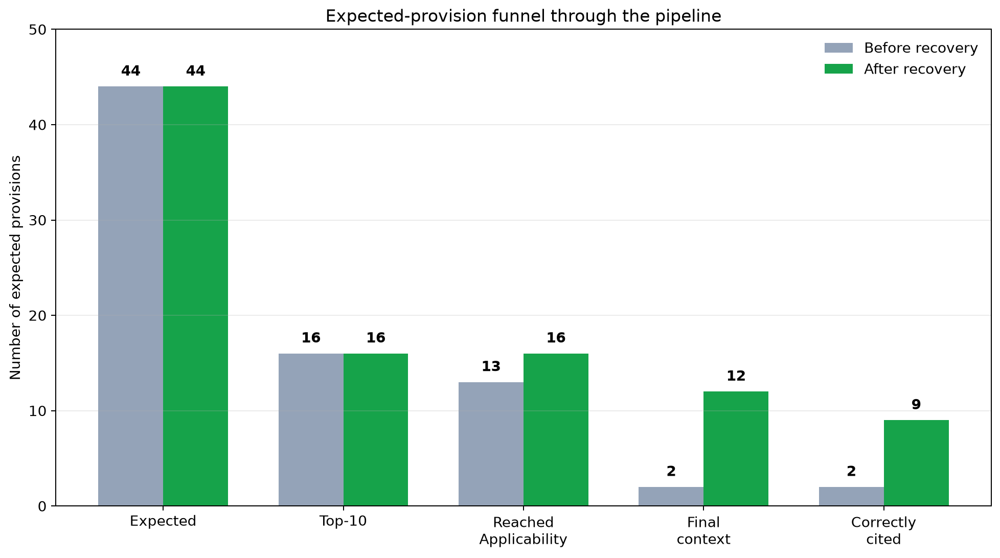
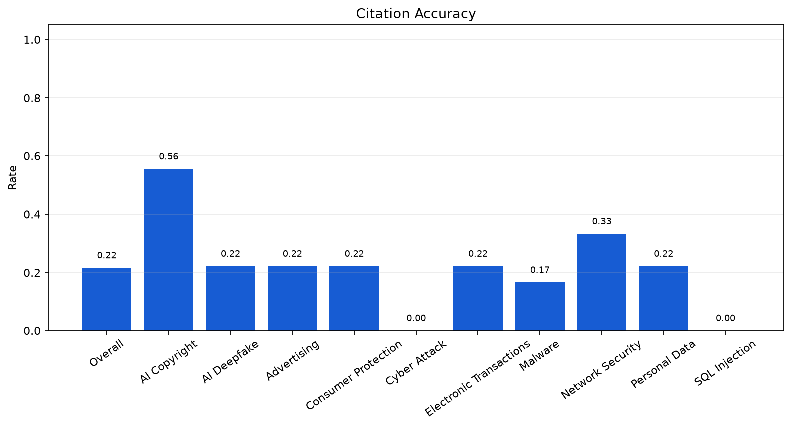
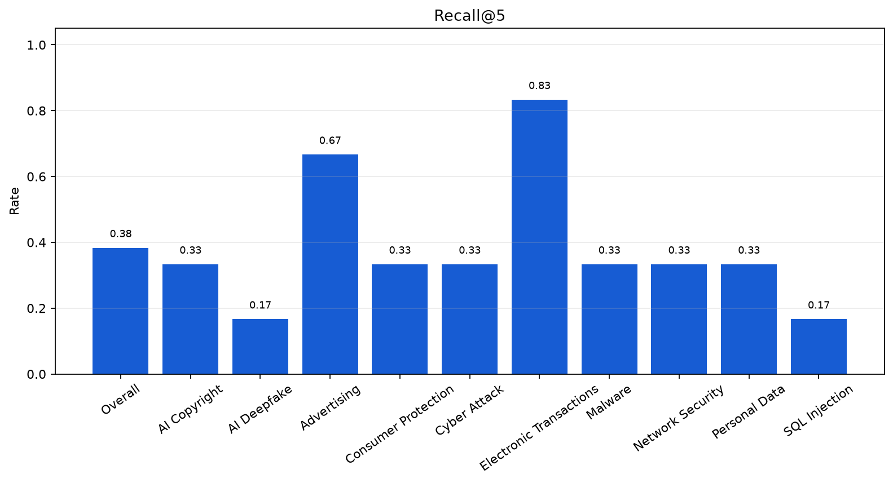

# LEGAL IT CHATBOT — Technical Handoff & Evaluation Roadmap

> **Ngày chốt tài liệu:** 2026-07-26  
> **Workspace:** `LEGAL_IT_CHATBOT`  
> **Mục đích:** giúp một cộng sự mới hiểu hệ thống hiện tại, những thay đổi đã thực hiện, bằng chứng benchmark, các vấn đề còn tồn tại và cách tiếp tục phát triển mà không sửa theo cảm tính.

---

## 1. Tóm tắt điều hành

Dự án đã đi qua bốn lớp cải tiến chính:

1. **Runtime và trải nghiệm demo:** cấu hình Ollama native trên macOS, Docker app kết nối tới Ollama host, UI có trạng thái xử lý và streaming bản trả lời đã được kiểm tra.
2. **Retrieval:** Query Expansion có kiểm soát, Domain-aware Retrieval, Hybrid Search, Cross Encoder, Behavior Card, Behavior Gate, deduplication và Recursive Retrieval có giới hạn.
3. **Legal grounding:** Legal Relevance, Legal Applicability, provenance xuyên suốt pipeline, citation theo nguồn retrieved, validation chống hallucination và fallback fail-closed.
4. **Evaluation-driven development:** benchmark 30 case, metric engine deterministic, error taxonomy, report/plot và một vòng sửa `Applicability Recovery & Retrieval Preservation` được kiểm chứng bằng benchmark thật.

Kết quả benchmark mới nhất:

```text
44 expected legal provisions
        ↓
16 xuất hiện trong top-10
        ↓
16 tới Applicability
        ↓
12 được giữ trong final context
        ↓
9 được cite đúng
```

Citation Accuracy tăng từ **5.56% lên 21.67%** và hallucinated citation vẫn bằng **0**. Tuy nhiên, Recall@10 vẫn chỉ **41.67%**, Applicability Accuracy giảm từ **74.33% xuống 53.83%**, và latency trung bình tăng từ **75.97 giây lên 106.42 giây**.

Do đó, trạng thái hiện tại nên được mô tả là:

> Retrieval integrity và khả năng bảo toàn căn cứ đã tốt hơn rõ rệt, nhưng candidate generation vẫn thiếu recall, Applicability còn giữ nhiều false positive, và Qwen thường không tuân thủ cấu trúc/citation khi sinh câu trả lời.

Không nên tiếp tục thêm feature lớn trước khi thiết kế thí nghiệm benchmark cho đúng một nguyên nhân cụ thể.

---

## 2. Trạng thái môi trường hiện tại

### 2.1. Thành phần runtime

| Thành phần | Công nghệ/cấu hình hiện tại |
|---|---|
| Giao diện | Chainlit, cổng `8000` |
| LLM local | Ollama native trên macOS, `qwen2.5:7b` |
| Embedding | `AITeamVN/Vietnamese_Embedding_v2` |
| Cross Encoder | `cross-encoder/mmarco-mMiniLMv2-L12-H384-v1` |
| Vector database | Qdrant embedded/local file |
| Sparse retrieval | BM25 |
| Knowledge Graph | Neo4j |
| Container | Docker Compose cho app, Neo4j và ingestion |
| Benchmark | Python runner, JSON/Markdown report, matplotlib plots |

### 2.2. Vì sao Ollama nên chạy native trên Mac

Ban đầu Ollama được chạy bằng container. Trên macOS, Docker Desktop không chuyển trực tiếp GPU Metal của máy vào container Linux, nên Qwen 7B chạy bằng CPU và có thể đứng rất lâu ở trạng thái “Đang xử lý”.

Thiết lập hiện tại cho app container gọi Ollama native qua:

```text
http://host.docker.internal:11434/v1
```

Các dòng liên quan nằm trong [`docker-compose.yml`](../docker-compose.yml).

Khởi tạo model native:

```bash
ollama pull qwen2.5:7b
ollama list
```

Khởi động app:

```bash
docker compose --profile app up -d app
```

Kiểm tra:

```bash
curl -I http://localhost:8000
docker logs --tail 100 legal_app
```

### 2.3. Dữ liệu Qdrant

Hai bộ index ban đầu được đặt trong `data/`, trong đó benchmark hiện dùng:

```text
data/.qdrant_base
```

Qdrant embedded chỉ cho một process mở cùng index. Khi chạy benchmark phải dừng app, nếu không sẽ gặp lỗi lock:

```bash
docker compose --profile app stop app
```

Sau benchmark phải bật app lại:

```bash
docker compose --profile app up -d app
```

---

## 3. Kiến trúc hiện hành

> **Lưu ý quan trọng:** [`KLTN_Project_Description.md`](KLTN_Project_Description.md) mô tả kiến trúc cũ, trong đó Critic sinh draft rồi mới tìm phần thiếu. Code hiện tại đã đổi: recursive completeness chạy hoàn toàn **trước Generation**. Khi có mâu thuẫn, ưu tiên tài liệu handoff này và code hiện tại.



### 3.1. Các invariant không được phá

- Query Expansion chỉ tăng recall, không được dùng làm query cuối để rerank.
- Query gốc luôn điều khiển Cross Encoder và relevance cuối.
- Hybrid Retrieval chỉ tìm trong các legal domain đã chọn.
- Behavior Card được tạo một lần ở Phase 2 và bất biến ở downstream.
- Recursive Retrieval luôn giữ nguyên chunk seed ban đầu; parent article chỉ được thêm, không thay thế seed.
- Recursive candidate phải qua Behavior Gate như hybrid candidate.
- Provenance không được chuyển sớm thành text thuần.
- Applicability không được tạo behavior mới.
- Generation chỉ được cite `SOURCE_ID` lấy từ final retrieved context.
- Mục `Căn cứ pháp lý` được hệ thống dựng từ source thật sự được cite, không để LLM tự tạo.
- Nếu không đủ căn cứ, pipeline phải fail-closed thay vì tự suy diễn.
- Log kỹ thuật chỉ nằm ở debug log, không xuất hiện trong nội dung người dùng.

---

## 4. Dòng thời gian các thay đổi

| Giai đoạn | Vấn đề quan sát | Thay đổi chính | Bằng chứng/kiểm tra |
|---|---|---|---|
| Runtime setup | Demo đứng lâu, Ollama container không dùng GPU Mac | Chuyển sang Ollama native, app gọi host | App trả HTTP 200; model chạy bằng Ollama native |
| UX | Người dùng chờ lâu, không biết pipeline đang làm gì | Progress status, streaming sau validation, auto-update Markdown | Trạng thái search/retrieve/analyze/write/complete trong `app.py` |
| Recursive Retrieval | Chỉ lấy một phần Điều hoặc bỏ tham chiếu | Recursive theo completeness, giới hạn depth/iterations | Unit test recursive; provenance log |
| Grounded Generation | Bịa Điều/Khoản/Nghị định/mức phạt | `SOURCE_ID`, validation, citation sanitizer, fallback | Hallucinated Citation = 0 |
| Legal synthesis | Kết luận theo từng Điều, không trả lời câu hỏi gốc | Tổng hợp theo từng câu hỏi người dùng | Prompt + validator bắt buộc section synthesis |
| Retrieval audit P0 | Expansion/rerank làm lệch query; lexical rerank yếu | Controlled expansion + Cross Encoder + original-query priority | Retrieval tests |
| Phase 1 | Sai domain, duplicate Điều/Khoản | `legal_domains`, domain filter, deduplication | Domain tests + logs |
| Phase 2 | Đúng domain nhưng sai hành vi | Behavior Card, behavior-aware rerank/gate | Behavior tests |
| Integrity | Recursive làm mất seed, Applicability rewrite behavior | Granular seed, recursive behavior gate, full provenance, validator | Integrity tests + trace |
| Evaluation | Chỉ smoke test, không biết nguyên nhân fail | 30-case benchmark, metrics, error taxonomy, plots | Baseline report |
| Recovery | 13 candidate đúng tới Applicability nhưng chỉ giữ 2 | Seed preservation, primary-action fix, KEEP/WEAK_KEEP/REMOVE | Benchmark after: 12 candidate đúng được giữ |

---

## 5. Chi tiết từng nhóm cải tiến

### 5.1. Query Expansion có kiểm soát

Module: [`query_expansion.py`](../src/agents/common/query_expansion.py)

Nguyên nhân ban đầu:

- Query mở rộng chứa nhiều thuật ngữ luật, làm candidate chỉ trùng từ khóa được đẩy lên cao.
- Expansion từng có nguy cơ trở thành query cuối cho reranking.

Thiết kế hiện tại:

```text
query gốc ────────────────┐
                          ├─ merge candidate pool ─ rerank bằng query gốc
query mở rộng ─ recall ───┘
```

Nếu query gốc và query mở rộng đưa ra kết quả khác nhau, candidate từ query gốc nhận ưu tiên. Expansion-only candidate vẫn có thể được giữ nếu Cross Encoder đánh giá phù hợp thật sự.

### 5.2. Domain-aware Retrieval — Phase 1

Các module chính:

- [`legal_domains.py`](../src/retrieval/legal_domains.py)
- [`backfill_legal_domains.py`](../src/data_ingestion/backfill_legal_domains.py)
- [`qdrant_hybrid_search.py`](../src/retrieval/qdrant_hybrid_search.py)
- [`node_hybrid_search.py`](../src/agents/agent_retrieval/node_hybrid_search.py)

Mỗi document có metadata multi-label `legal_domains`, ví dụ:

```json
{
  "legal_domains": ["cybersecurity", "administrative_penalty"]
}
```

Các domain hiện được hỗ trợ gồm cybersecurity, personal data, civil personality, advertising, intellectual property, criminal, administrative penalty, consumer protection, digital technology, AI, data governance, electronic transactions, e-commerce, telecommunications và một số domain khác.

Hybrid Search dùng Qdrant filter để chỉ tìm trong domain được chọn. Final top-k được deduplicate theo:

```text
document + article + clause
```

Log quan trọng:

- `selected_domains`
- `filtered_domains`
- `candidate_count_by_domain`
- `duplicate_removed`

### 5.3. Behavior Extraction & Behavior-aware Reranking — Phase 2

Các module:

- [`legal_behaviors.py`](../src/retrieval/legal_behaviors.py)
- [`retrieval_ranking.py`](../src/agents/common/retrieval_ranking.py)
- [`cross_encoder_reranker.py`](../src/agents/common/cross_encoder_reranker.py)

Behavior Card gồm bốn nhóm:

```json
{
  "actions": [],
  "objects": [],
  "purposes": [],
  "conditions": []
}
```

Ví dụ deepfake quảng cáo:

```json
{
  "actions": ["create_ai_deepfake", "use_person_likeness"],
  "objects": ["synthetic_media", "person_likeness"],
  "purposes": ["advertising"],
  "conditions": []
}
```

Điểm cuối của candidate kết hợp semantic score, behavior score, original-query bonus và reciprocal-rank bonus. Behavior Gate chỉ kích hoạt khi taxonomy nhận ra ít nhất một match đáng tin cậy; nếu không, gate không làm rỗng context.

Ngưỡng hiện tại:

```text
BEHAVIOR_GATE_MIN_SCORE=0.18
BEHAVIOR_GATE_ACTIVATION_SCORE=0.35
```

### 5.4. Recursive Retrieval & Retrieval Integrity

Module: [`recursive_retrieval.py`](../src/agents/agent_retrieval/recursive_retrieval.py)

Recursive Retrieval xử lý:

- Điều mới chỉ retrieve một phần.
- Khoản/Điểm còn thiếu.
- Chế tài kép nằm ở phần khác của cùng Điều.
- Điều đang tham chiếu sang Điều khác.

Giới hạn mặc định:

```text
RECURSIVE_MAX_DEPTH=3
RECURSIVE_MAX_ITERATIONS=5
```

Integrity fix đảm bảo:

- Seed giữ đủ `document/article/clause/point`.
- Nếu KG chỉ có article-level node, không tự thay seed bằng parent.
- Parent/recursive candidate phải được chấm lại `behavior_score`.
- Candidate recursive dưới threshold bị loại.
- Candidate lưu đầy đủ lineage tới trước Generation.

Schema provenance chính:

```text
chunk_id
parent_id
document
article
clause
point
retrieval_score
behavior_score
cross_encoder_score
recursive_depth
is_seed
expansion_reason
provenance_chain
```

Module carrier: [`retrieval_provenance.py`](../src/agents/common/retrieval_provenance.py).

### 5.5. Legal Relevance và Legal Applicability

Các module:

- [`legal_relevance_filter.py`](../src/agents/common/legal_relevance_filter.py)
- [`legal_applicability.py`](../src/agents/common/legal_applicability.py)

Hai bước trả lời hai câu hỏi khác nhau:

| Bước | Câu hỏi |
|---|---|
| Legal Relevance | Đoạn luật có gần query về semantic không? |
| Legal Applicability | Quy tắc này có thực sự điều chỉnh hành vi/tình huống không? |

Applicability chỉ được dùng các key có trong Behavior Card và chỉ được chấm:

```text
MATCH
PARTIAL_MATCH
NOT_MATCH
```

Nếu tạo behavior mới, decision bị đánh `INVALID`.

Recovery mới nhất tách đánh giá khỏi hành động cuối:

```text
KEEP
WEAK_KEEP
REMOVE
```

Quy tắc an toàn quan trọng:

- Seed relevance thấp vẫn được truyền sang Applicability.
- Seed không tự động vượt qua một Applicability `LOW` hợp lệ.
- Behavior Card không có primary action thì validator không được ép match action.
- Card chỉ có object, purpose hoặc condition vẫn hợp lệ.
- Behavior bịa vẫn bị từ chối; nếu seed được weakly preserved thì chỉ source text được chuyển sang Generation, không chuyển behavior bịa.
- Recursive candidate khác behavior với seed vẫn bị loại.

Instrumentation mới:

```text
seed_preserved
seed_survived
seed_removed
behavior_preserved
relevance_removed
applicability_removed
reason_removed
decision_stage
```

### 5.6. Grounded Generation, citation và legal synthesis

Các module:

- [`prompts.py`](../src/agents/agent_generation/prompts.py)
- [`grounded_validation.py`](../src/agents/common/grounded_validation.py)
- [`legal_response.py`](../src/agents/common/legal_response.py)

Mỗi source retrieved được cấp một ID nội bộ:

```text
S1, S2, S3, ...
```

LLM chỉ được cite bằng marker:

```text
[[CITE:S1]]
[[QUOTE:S1]]
```

Validator kiểm tra:

- Document/Điều/Khoản/Điểm có tồn tại trong source được cite.
- Trích luật có đúng source.
- Con số chế tài có trong source.
- Kết luận pháp lý có inline citation.
- Mỗi điều luật có phân tích riêng, không dùng template chung chung.
- Phần synthesis trả lời từng câu hỏi gốc thay vì kết luận theo từng Điều.
- Mục `Căn cứ pháp lý` chỉ chứa source thật sự được dùng.

Nếu draft lỗi, pipeline lần lượt thử:

1. salvage các block grounded hợp lệ;
2. extractive grounded answer;
3. conservative grounded answer;
4. safe fallback “Chưa đủ căn cứ...” nếu không còn source đáng tin.

Điều này giải thích vì sao hallucinated citation cuối bằng 0 nhưng nhiều câu trả lời vẫn rơi vào fallback.

### 5.7. UX: progress và streaming

Module chính: [`app.py`](../app.py)

UI hiện hiển thị:

```text
🔎 Đang tìm kiếm văn bản pháp luật...
📚 Đang truy xuất điều luật...
⚖️ Đang phân tích căn cứ pháp lý...
✍️ Đang tạo câu trả lời...
✅ Hoàn tất
```

Chit-chat có thể stream token trực tiếp. Câu trả lời pháp lý được buffer cho tới khi qua grounding validation, sau đó stream theo cụm Markdown. Đây là lựa chọn an toàn có chủ đích:

- Ưu điểm: không stream citation/hallucination rồi sửa lại sau.
- Nhược điểm: người dùng vẫn phải chờ phần Applicability và Generation; progress indicator quan trọng hơn raw-token streaming trong giai đoạn này.

---

## 6. Evaluation Framework

Thư mục: [`evaluation/`](../evaluation/)

```text
evaluation/
├── benchmark/
│   ├── benchmark.json
│   └── README.md
├── metrics.py
├── reporting.py
├── run_benchmark.py
├── tests/
└── results/
```

### 6.1. Dataset hiện tại

- 30 testcase.
- 10 category.
- Mỗi category có Easy, Medium và Hard.
- 44 expected legal provisions.

Category:

- AI Deepfake
- Personal Data
- Cyber Attack
- SQL Injection
- Malware
- AI Copyright
- Advertising
- Consumer Protection
- Network Security
- Electronic Transactions

### 6.2. Metric

| Metric | Ý nghĩa thực tế |
|---|---|
| Domain Recall/Precision | Domain đúng có được mở và có mở thừa không |
| Behavior Recall/Precision | Behavior Card có đủ và có bịa/thừa không |
| Recall@5/@10 | Căn cứ đúng có nằm trong candidate đầu không |
| MRR | Căn cứ đúng đầu tiên đứng hạng bao nhiêu |
| Citation Accuracy | F1 giữa citation cuối và expected provisions |
| Wrong Domain/Behavior Rate | Phần domain/behavior sai |
| Recursive Precision/Noise | Recursive context có hữu ích hay gây nhiễu |
| Applicability Accuracy | Keep/drop so với ground truth trên candidate được đánh giá |
| Retrieval/Total latency | Chi phí thời gian theo tầng |

### 6.3. Hai lỗi evaluator đã được sửa

Trong lần chạy thật đầu tiên phát hiện hai false measurement:

1. Candidate thiếu metadata Điều/Khoản/Điểm nhưng `chunk_id` có đủ tọa độ bị tính thành miss. Metric engine hiện fallback parse `chunk_id`.
2. Citation parser từng hiểu nhầm câu “Nội dung điều luật: Khoản 1, Điều 10...” thành tên văn bản. Regex hiện chỉ nhận tên văn bản pháp lý hợp lệ hoặc tên file corpus.

Không có Retrieval/Generation code nào bị thay đổi bởi hai sửa này.

---

## 7. Benchmark baseline: nguyên nhân theo dữ liệu

Report gốc:

- [`error_analysis.md`](../evaluation/results/benchmark_30_real_20260726/error_analysis.md)
- [`benchmark_summary.json`](../evaluation/results/benchmark_30_real_20260726/benchmark_summary.json)
- [`benchmark_details.json`](../evaluation/results/benchmark_30_real_20260726/benchmark_details.json)

### 7.1. Baseline metrics

| Metric | Baseline |
|---|---:|
| Domain Recall | 57.83% |
| Domain Precision | 80.44% |
| Behavior Recall | 30.85% |
| Behavior Precision | 59.17% |
| Recall@5 | 38.33% |
| Recall@10 | 41.67% |
| MRR | 0.3114 |
| Citation Accuracy | 5.56% |
| Wrong Domain Rate | 19.56% |
| Recursive Noise | 10.00% |
| Applicability Accuracy | 74.33% |
| Retrieval latency | 4.04 giây |
| Total latency | 75.97 giây |

### 7.2. Root cause breakdown

> Các nhóm lỗi dưới đây có thể overlap, không được cộng lại như các nhóm loại trừ nhau.

| Nguyên nhân | Bằng chứng |
|---|---:|
| Corpus thiếu expected provision | **0** |
| Domain Selection chặn căn cứ đúng | 9 provisions / 7 cases |
| Sai retrieval/ranking trong domain đã mở | 19 provisions / 14 cases |
| Behavior key chưa có trong taxonomy | 15 labels / 11 cases |
| Behavior được hỗ trợ nhưng extractor bỏ sót | 57 labels / 22 cases |
| Correct provision bị Legal Relevance loại | 3 provisions |
| Correct provision tới Applicability nhưng bị loại | 11/13 |
| Recursive noise | 3 cases |
| Raw Generation fail grounding | 29/30 cases |
| Hallucinated citation lọt ra output | 0 cases |

### 7.3. Những kết luận quan trọng

#### Không nên ingest thêm luật trước

Audit 18 file DOCX cho thấy toàn bộ 44 expected provisions đều tồn tại trong corpus nguồn. Chưa có bằng chứng “corpus thiếu” cho benchmark hiện tại.

#### Không nên chỉ tăng top-k

- 15/44 expected provisions ở top-5.
- 16/44 ở top-10.

Tăng từ 5 lên 10 chỉ cứu thêm một provision. Vấn đề là candidate generation/ranking, không phải chỉ do top-k nhỏ.

#### Luật An ninh mạng Điều 13 là recurring failure

Điều này bị miss lặp lại ở Deepfake, Cyber Attack và SQL Injection dù domain cybersecurity đã được mở. Đây là regression subset tốt nhất cho thí nghiệm within-domain retrieval tiếp theo.

#### Applicability Accuracy baseline gây hiểu nhầm

74.33% bị true negative chi phối. Relevant preservation thực tế chỉ là:

```text
2 / 13 = 15.38%
```

---

## 8. Benchmark sau Applicability Recovery

Report mới:

- [`regression_analysis.md`](../evaluation/results/benchmark_30_applicability_recovery_20260726/regression_analysis.md)
- [`benchmark_summary.json`](../evaluation/results/benchmark_30_applicability_recovery_20260726/benchmark_summary.json)
- [`benchmark_details.json`](../evaluation/results/benchmark_30_applicability_recovery_20260726/benchmark_details.json)

### 8.1. So sánh Before vs After



| Metric | Before | After | Delta |
|---|---:|---:|---:|
| Domain Recall | 57.83% | 57.83% | 0.00 pp |
| Behavior Recall | 30.85% | 30.85% | 0.00 pp |
| Recall@5 | 38.33% | 38.33% | 0.00 pp |
| Recall@10 | 41.67% | 41.67% | 0.00 pp |
| Citation Accuracy | 5.56% | **21.67%** | **+16.11 pp** |
| Wrong Domain Rate | 19.56% | 19.56% | 0.00 pp |
| Applicability Accuracy | 74.33% | **53.83%** | **−20.51 pp** |
| Recursive Noise | 10.00% | 10.00% | 0.00 pp |
| Hallucinated Citation | 0 | 0 | 0 |
| Retrieval latency | 4.04 s | 4.22 s | +0.18 s |
| Total latency | 75.97 s | **106.42 s** | +30.45 s |

### 8.2. Funnel



| Stage | Before | After |
|---|---:|---:|
| Expected provisions | 44 | 44 |
| Retrieved top-10 | 16 | 16 |
| Reached Applicability | 13 | 16 |
| Kept in final context | 2 | 12 |
| Correctly cited | 2 | 9 |
| Cases có final context rỗng | 21 | 6 |

### 8.3. Kết quả theo category





### 8.4. Case cải thiện

Citation cải thiện end-to-end:

| Case | Before | After |
|---|---:|---:|
| `malware_easy_001` | 0% | 50% |
| `ai_copyright_easy_001` | 0% | 100% |
| `ai_copyright_medium_001` | 0% | 66.67% |
| `advertising_medium_001` | 0% | 66.67% |
| `consumer_easy_001` | 0% | 66.67% |
| `network_security_easy_001` | 0% | 100% |
| `electronic_transactions_medium_001` | 0% | 66.67% |

Candidate preservation tăng nhưng citation chưa tăng:

- `cyber_attack_easy_001`
- `sql_injection_medium_001`
- `advertising_easy_001`

Case bị giảm:

- `personal_data_medium_001`: Citation Accuracy giảm từ 100% xuống 66.67%. Căn cứ đúng vẫn nằm trong final context; lỗi xảy ra ở citation selection/rendering khi context lớn hơn.

### 8.5. Trade-off cần hiểu đúng

Applicability sau recovery:

```text
Relevant recall:    15.38% → 75.00%
Relevant precision: 14.29% → 13.95%
```

Số article được giữ tăng từ 14 lên 86. Điều này cứu nhiều candidate đúng nhưng cũng tăng context noise và latency. Vì vậy recovery đạt mục tiêu recall/citation, nhưng không phải một chiến thắng tuyệt đối về precision hoặc chi phí.

---

## 9. Bản đồ code hiện tại

### Retrieval

| Trách nhiệm | File |
|---|---|
| Orchestrate hybrid retrieval | [`node_hybrid_search.py`](../src/agents/agent_retrieval/node_hybrid_search.py) |
| Domain-aware Qdrant search | [`qdrant_hybrid_search.py`](../src/retrieval/qdrant_hybrid_search.py) |
| Domain taxonomy/selector | [`legal_domains.py`](../src/retrieval/legal_domains.py) |
| Behavior taxonomy/extractor | [`legal_behaviors.py`](../src/retrieval/legal_behaviors.py) |
| Cross Encoder | [`cross_encoder_reranker.py`](../src/agents/common/cross_encoder_reranker.py) |
| Ranking/gates/dedup | [`retrieval_ranking.py`](../src/agents/common/retrieval_ranking.py) |
| Query Expansion | [`query_expansion.py`](../src/agents/common/query_expansion.py) |
| Recursive Retrieval | [`recursive_retrieval.py`](../src/agents/agent_retrieval/recursive_retrieval.py) |
| Provenance | [`retrieval_provenance.py`](../src/agents/common/retrieval_provenance.py) |

### Generation & integrity

| Trách nhiệm | File |
|---|---|
| Legal Relevance | [`legal_relevance_filter.py`](../src/agents/common/legal_relevance_filter.py) |
| Legal Applicability | [`legal_applicability.py`](../src/agents/common/legal_applicability.py) |
| Grounding validator/fallback | [`grounded_validation.py`](../src/agents/common/grounded_validation.py) |
| Prompt | [`prompts.py`](../src/agents/agent_generation/prompts.py) |
| Citation/source rendering | [`legal_response.py`](../src/agents/common/legal_response.py) |
| Workflow orchestration | [`pipeline.py`](../src/workflow/pipeline.py) |
| LLM streaming/token usage | [`llm_client.py`](../src/agents/common/llm_client.py) |
| Chainlit UI | [`app.py`](../app.py) |

### Data & evaluation

| Trách nhiệm | File |
|---|---|
| Structure-aware chunking | [`chunking.py`](../src/data_processing/chunking.py) |
| Domain backfill | [`backfill_legal_domains.py`](../src/data_ingestion/backfill_legal_domains.py) |
| Benchmark dataset | [`benchmark.json`](../evaluation/benchmark/benchmark.json) |
| Runner | [`run_benchmark.py`](../evaluation/run_benchmark.py) |
| Metrics | [`metrics.py`](../evaluation/metrics.py) |
| Reporting/plots | [`reporting.py`](../evaluation/reporting.py) |

---

## 10. Testing và cách tái hiện

### 10.1. Unit tests

Kết quả hiện tại:

```text
78 pipeline tests: PASS
11 evaluation tests: PASS
```

Chạy bằng Docker image hiện tại:

```bash
docker run --rm \
  -v "$PWD/src:/app/src:ro" \
  -v "$PWD/tests:/app/tests:ro" \
  -v "$PWD/data:/app/data:ro" \
  -w /app legal_it_chatbot-app \
  python -m unittest discover -s tests -v

python3 -m unittest discover -s evaluation/tests -v
```

### 10.2. Chạy một case

```bash
python evaluation/run_benchmark.py --case-id sql_injection_easy_001
```

### 10.3. Chạy full benchmark

Nếu chạy trực tiếp trên môi trường Python đã cài đủ dependency:

```bash
docker compose --profile app stop app
python evaluation/run_benchmark.py \
  --output-dir evaluation/results/<experiment_name>
docker compose --profile app up -d app
```

Runner hỗ trợ:

```bash
python evaluation/run_benchmark.py --category deepfake
python evaluation/run_benchmark.py --category sql_injection
python evaluation/run_benchmark.py --difficulty hard
python evaluation/run_benchmark.py --validate-only
```

### 10.4. Quy tắc so sánh thí nghiệm

Phải giữ cố định:

- benchmark SHA-256;
- Qdrant snapshot;
- mode;
- top-k;
- embedding model;
- Cross Encoder model/revision;
- Ollama model;
- environment thresholds.

Mỗi experiment dùng một output directory riêng. Không sửa benchmark ground truth trong cùng commit với code pipeline.

### 10.5. Cảnh báo reproducibility

Benchmark hiện gọi Qwen với `temperature=0.2`, nên Citation Accuracy có thể dao động giữa các lần chạy dù Retrieval giống nhau. Smoke run và full run đã từng cho citation khác nhau trên cùng case Malware.

Đối với báo cáo khoa học:

- chạy ít nhất 3 lần cho metric liên quan Generation;
- báo mean và standard deviation;
- hoặc khóa cấu hình deterministic nếu Ollama/model hỗ trợ;
- dùng candidate-preservation metric để tách signal deterministic khỏi variance của Generation.

Khi chạy benchmark trong Docker mà không mount `.git`, trường commit trong summary sẽ rỗng. Phải ghi commit/dirty state từ host vào experiment note.

---

## 11. Những vấn đề còn tồn tại

### 11.1. Retrieval top-10 còn thiếu 28/44 căn cứ

Recall@10 hiện chỉ 41.67%. Hai nguyên nhân đã được tách:

- 9 provisions bị chặn bởi Domain Selection.
- 19 provisions bị miss dù domain đúng đã mở.

Không được gộp hai lỗi này thành “Retriever kém” vì cần hai experiment khác nhau.

### 11.2. Domain fallback còn yếu

Năm case từng rơi vào generic fallback domains:

- `cyber_attack_easy_001`
- `cyber_attack_medium_001`
- `consumer_medium_001`
- `electronic_transactions_easy_001`
- `electronic_transactions_medium_001`

`consumer_medium_001` là case rõ nhất: fallback không mở consumer protection.

### 11.3. Behavior taxonomy chưa đủ

12 expected behavior key chưa có trong taxonomy:

- `automated_electronic_contract`
- `confirm_receipt`
- `correct_input_error`
- `deploy_malware`
- `detect_or_remove_malware`
- `receive_data_message`
- `research_malware`
- `secure_information_system`
- `send_data_message`
- `supply_defective_product`
- `use_electronic_notice`
- `use_unfair_contract_term`

Chúng tương ứng 15 expected labels trong 11 case.

Behavior Recall 30.85% đang trộn hai loại lỗi:

1. taxonomy không hỗ trợ key;
2. key được hỗ trợ nhưng extraction miss.

Phải thêm `Supported-only Behavior Recall` trước khi đánh giá một thay đổi extractor.

### 11.4. Applicability recall tăng nhưng precision không tăng

Recovery giữ 12/16 candidate đúng, nhưng tổng số article giữ tăng lên 86. Đây là nguyên nhân:

- Applicability Accuracy giảm;
- final context dài hơn;
- total latency tăng khoảng 40%;
- một case citation bị regression.

### 11.5. Generation vẫn không ổn định

Raw Generation fail grounding 29/30 case ở cả baseline và after. Lỗi thường gặp:

- thiếu heading bắt buộc;
- thiếu citation trên cùng dòng kết luận;
- cite sai Điều/Khoản;
- tạo con số chế tài không có trong source;
- không trả lời từng câu hỏi gốc;
- dùng cùng template phân tích cho nhiều Điều.

Validator chặn được hallucination, nhưng fallback làm chất lượng câu trả lời thấp hoặc chung chung.

### 11.6. Benchmark còn nhỏ

30 case phù hợp smoke/regression, chưa đủ mạnh để kết luận chất lượng tổng quát. Ground truth cũng cần luật sư/giảng viên review trước khi dùng làm kết quả luận văn chính thức.

### 11.7. Worktree chưa sạch

Hiện nhiều file sửa đổi và file mới chưa được commit. Trước khi giao cho cộng sự:

1. review toàn bộ `git status`;
2. không reset hoặc ghi đè các thay đổi hiện hữu;
3. tách commit theo phase hoặc ít nhất tạo một checkpoint commit rõ ràng;
4. ghi benchmark directory tương ứng trong commit message/PR description.

---

## 12. Roadmap tiếp theo — chỉ làm khi benchmark chỉ ra

### Nguyên tắc

Mỗi thay đổi phải có contract:

```text
Hypothesis
↓
Target cases
↓
Target metric
↓
Guardrails
↓
Full benchmark
↓
Keep hoặc revert
```

### Experiment 1 — Hoàn thiện metric trước khi sửa pipeline

**Mục tiêu:** tách đúng precision/recall của từng gate.

Chỉ sửa Evaluation Framework để bổ sung:

- Relevant Candidate Recall tại Legal Relevance.
- Relevant Candidate Recall tại Applicability.
- Applicability Precision.
- Final Context Precision/Recall.
- Supported-only Behavior Recall.
- Empty Final Context Rate.

**Không sửa production pipeline trong experiment này.**

### Experiment 2 — Within-domain retrieval cho Luật An ninh mạng Điều 13

**Hypothesis:** Điều 13 bị mất do candidate generation/ranking trong domain, không phải domain filter hay corpus.

**Target cases:** Deepfake, Cyber Attack và SQL Injection có expected Điều 13.

**Target:** tăng Recall@10 trên subset này.

**Guardrails:**

- Wrong Domain không tăng.
- Recall của các case Personal Data/Advertising không giảm.
- Duplicate rate không tăng.
- Không đổi Generation.

Không được chỉ tăng top-k, vì top-5 → top-10 chỉ cứu một provision trên toàn benchmark.

### Experiment 3 — Domain rule coverage

**Target:** 9 provisions bị domain selection chặn.

Ưu tiên:

- `consumer_medium_001`;
- `deepfake_medium_001`;
- `personal_data_hard_001`;
- `network_security_medium_001`.

**Target metric:** Domain Recall tăng, Wrong Domain Rate không tăng quá ngưỡng được thống nhất.

### Experiment 4 — Behavior taxonomy vs extractor

Tách làm hai commit/thí nghiệm:

1. thêm missing taxonomy keys;
2. sau đó mới sửa signal/extractor cho supported keys.

Không làm đồng thời, nếu không sẽ không biết Behavior Recall tăng do coverage hay extraction.

### Experiment 5 — Applicability precision recovery

**Baseline mới:**

```text
Correct final-context provisions: 12
Citation Accuracy: 21.67%
Applicability Accuracy: 53.83%
Hallucinated Citation: 0
Total latency: 106.42 s
```

**Mục tiêu:** giảm false positive/latency mà không quay lại lỗi over-filtering.

**Acceptance contract đề xuất:**

- correct final-context provisions không dưới 12;
- Citation Accuracy không dưới 21.67%;
- Applicability Accuracy tăng;
- hallucinated citation vẫn 0;
- empty final context không tăng quá baseline mới là 6 case;
- total latency giảm.

Không được đưa lại rule “phải có primary action” vì benchmark đã chứng minh rule đó sai với object-only/purpose-only cards.

### Experiment 6 — Generation reliability

Chỉ bắt đầu sau khi final-context precision/recall được đo ổn định.

Không chỉ sửa prompt. Cần so sánh ít nhất:

- Qwen raw compliance rate;
- salvage rate;
- extractive fallback rate;
- final citation F1;
- latency và token usage;
- output quality do người chấm.

### Experiment 7 — Mở rộng benchmark và Human Evaluation

Mục tiêu dataset:

```text
200–500 automated benchmark cases
50 human-evaluation cases
```

Human rubric 1–5:

- Relevance
- Legal correctness
- Citation correctness
- Reasoning
- Completeness

Người chấm nên gồm giảng viên, luật sư hoặc nhà nghiên cứu pháp luật/công nghệ.

---

## 13. Những việc không nên làm

- Không sửa nhiều stage trong một lần benchmark.
- Không tăng top-k như một cách chữa chung.
- Không ingest thêm luật khi chưa có case chứng minh corpus thiếu.
- Không dùng Query Expansion làm query rerank cuối.
- Không cho Recursive Retrieval mở từ seed semantic yếu.
- Không thay seed granular bằng parent article.
- Không tin aggregate Applicability Accuracy mà bỏ qua relevant recall/precision.
- Không sửa Generation prompt để che một lỗi final context rỗng.
- Không tắt validator chỉ để câu trả lời “trông đầy đủ hơn”.
- Không benchmark cùng lúc app đang giữ Qdrant embedded lock.
- Không dùng một smoke test để tuyên bố toàn pipeline đã tốt.
- Không dùng một lần chạy Qwen để kết luận metric Generation ổn định.

---

## 14. Checklist cho cộng sự mới

### Ngày đầu tiên

- [ ] Đọc tài liệu này.
- [ ] Đọc baseline [`error_analysis.md`](../evaluation/results/benchmark_30_real_20260726/error_analysis.md).
- [ ] Đọc after [`regression_analysis.md`](../evaluation/results/benchmark_30_applicability_recovery_20260726/regression_analysis.md).
- [ ] Kiểm tra `git status`, không ghi đè worktree.
- [ ] Chạy 78 pipeline tests và 11 evaluation tests.
- [ ] Chạy một case smoke và kiểm tra `actual.retrieval_decisions`.
- [ ] Xác nhận app trả HTTP 200 sau khi benchmark.

### Trước mỗi thay đổi

- [ ] Ghi hypothesis.
- [ ] Chọn target case IDs.
- [ ] Chọn đúng target metric.
- [ ] Ghi guardrail metrics.
- [ ] Chỉ sửa một module/stage.

### Sau mỗi thay đổi

- [ ] Chạy unit tests.
- [ ] Chạy target subset.
- [ ] Chạy đủ 30 case.
- [ ] Lưu output directory riêng.
- [ ] So sánh improved/unchanged/regressed cases.
- [ ] Nếu target metric không tăng, ghi nhận thất bại hoặc revert.
- [ ] Không tuyên bố thành công nếu chỉ có log đẹp nhưng citation/final context không cải thiện.

---

## 15. Nguồn sự thật để kiểm chứng

| Nội dung | Artifact |
|---|---|
| Benchmark ground truth | [`benchmark.json`](../evaluation/benchmark/benchmark.json) |
| Baseline metrics | [`benchmark_summary.json`](../evaluation/results/benchmark_30_real_20260726/benchmark_summary.json) |
| Baseline per-case trace | [`benchmark_details.json`](../evaluation/results/benchmark_30_real_20260726/benchmark_details.json) |
| Baseline root causes | [`error_analysis.md`](../evaluation/results/benchmark_30_real_20260726/error_analysis.md) |
| Recovery metrics | [`benchmark_summary.json`](../evaluation/results/benchmark_30_applicability_recovery_20260726/benchmark_summary.json) |
| Recovery per-case trace | [`benchmark_details.json`](../evaluation/results/benchmark_30_applicability_recovery_20260726/benchmark_details.json) |
| Recovery comparison | [`regression_analysis.md`](../evaluation/results/benchmark_30_applicability_recovery_20260726/regression_analysis.md) |
| Evaluation documentation | [`evaluation/README.md`](../evaluation/README.md) |
| Environment defaults | [`.env.example`](../.env.example) |

---

## 16. Kết luận bàn giao

Hệ thống hiện không còn ở giai đoạn “thêm feature để chatbot có vẻ thông minh hơn”. Nó đã bước vào giai đoạn **evaluation-driven development**.

Thành tựu quan trọng nhất không chỉ là Citation Accuracy tăng, mà là pipeline đã có khả năng giải thích candidate chết ở stage nào:

```text
Domain
→ Retrieval
→ Behavior Gate
→ Recursive
→ Legal Relevance
→ Applicability
→ Final Context
→ Citation
```

Cộng sự tiếp theo nên bảo vệ khả năng quan sát này, chọn một failure cluster từ benchmark, chạy experiment nhỏ có guardrail, rồi mới chạy full benchmark. Không có metric tăng thì không xem thay đổi là thành công.
