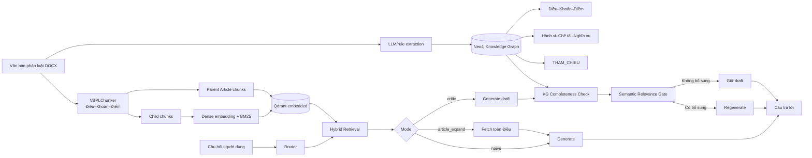
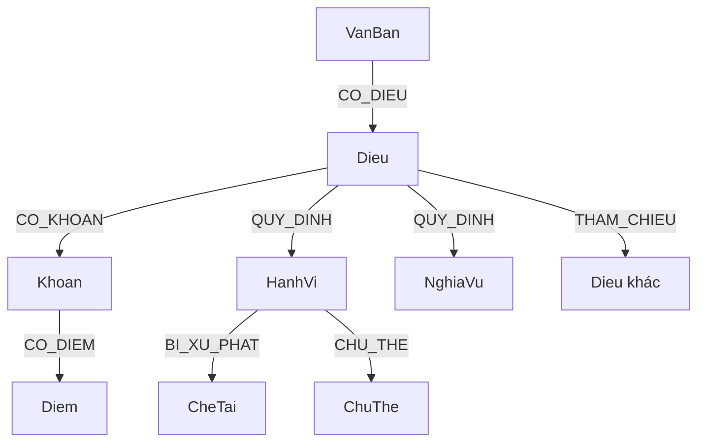

# LEGAL IT CHATBOT

## Tài liệu trình bày dự án và phân tích khoảng trống của paper

**Ngày lập:** 31/07/2026  
**Phiên bản code đang phân tích:** commit `9bf145e6744599e1e15c21e2011a02f7ecff87f5`  
**Ngôn ngữ trình bày:** Tiếng Việt  
**Mục đích:** dùng làm kịch bản thuyết trình dự án, khung viết paper và checklist hoàn thiện trước khi nộp.

> **Quy ước bằng chứng**
>
> - **Đã kiểm chứng:** đối chiếu trực tiếp với code, dữ liệu hoặc runtime hiện tại.
> - **Được báo cáo:** có trong tài liệu của repo nhưng thiếu artifact gốc để tái kiểm tra độc lập.
> - **Đề xuất:** nội dung nên bổ sung vào paper hoặc thí nghiệm cần chạy; không được trình bày như kết quả đã có.

---

## 1. Bản tóm tắt có thể nói trong 60 giây

LEGAL IT CHATBOT là hệ thống hỏi đáp pháp luật Việt Nam theo hướng Retrieval-Augmented Generation (RAG), tập trung vào sở hữu trí tuệ và các lĩnh vực công nghệ thông tin liên quan. Vấn đề mà dự án giải quyết là retrieval theo các đoạn văn bản rời rạc thường lấy đúng một khoản hoặc một điểm nhưng bỏ sót phần còn lại của điều luật, chế tài bổ sung hoặc điều khoản được dẫn chiếu. Trong pháp luật, thiếu một mảnh như vậy có thể làm câu trả lời đúng một phần nhưng sai về mặt tư vấn.

Hệ thống đề xuất ba lớp xử lý chính. Thứ nhất, văn bản được chunk theo cấu trúc **Điều–Khoản–Điểm**, đồng thời duy trì quan hệ parent–child để có thể mở rộng từ một đoạn nhỏ lên toàn Điều. Thứ hai, dense embedding và BM25 được hợp nhất bằng Reciprocal Rank Fusion trong Qdrant. Thứ ba, ở chế độ đề xuất, một **Critic Agent** dùng Knowledge Graph trong Neo4j để phát hiện phần pháp lý có thể còn thiếu, đưa ứng viên qua semantic relevance gate, rồi chỉ sinh lại câu trả lời khi có bằng chứng bổ sung thật sự liên quan.

Đóng góp đáng bảo vệ nhất của paper là: **một cơ chế kiểm tra độ đầy đủ sau retrieval dựa trên cấu trúc điều luật và quan hệ pháp lý, thay vì luôn mở rộng toàn bộ ngữ cảnh**. Tuy nhiên, ở trạng thái repo hiện tại, paper chưa có đủ artifact kết quả của thí nghiệm ba chế độ để chứng minh định lượng claim này. Đây là phần phải hoàn thiện trước khi nộp.

---

## 2. Tiêu đề paper đề xuất

### Tiêu đề tiếng Việt

**RAG có kiểm tra độ đầy đủ dựa trên đồ thị tri thức cho hỏi đáp pháp luật Việt Nam**

### Tiêu đề tiếng Anh

**Knowledge-Graph-Guided Completeness Checking for Vietnamese Legal Retrieval-Augmented Generation**

### Tiêu đề nhấn mạnh cơ chế chọn lọc ngữ cảnh

**Selective Legal Context Completion with a Knowledge-Graph Critic for Vietnamese Statutory Question Answering**

Không nên dùng tiêu đề quá rộng như “A Complete Legal Reasoning System” vì hệ thống hiện đánh giá chủ yếu khả năng retrieval và độ đầy đủ của câu trả lời trên văn bản quy phạm, chưa đánh giá toàn bộ năng lực suy luận pháp lý, giải quyết tranh chấp hoặc tư vấn như luật sư.

---

## 3. Câu hỏi nghiên cứu và giả thuyết nên công bố rõ

Paper hiện có mô tả hệ thống nhưng chưa đóng khung rõ bằng Research Questions. Nên bổ sung:

### RQ1 — Độ đầy đủ pháp lý

**Việc bổ sung Critic Agent dựa trên Knowledge Graph có cải thiện Legal Completeness Rate so với naive RAG và mở rộng toàn Điều hay không?**

- H1: `critic` có Legal Completeness Rate cao hơn `naive` trên các câu hỏi có chế tài kép, cấu trúc nhiều phần và tham chiếu chéo.
- H2: `critic` có lợi thế rõ nhất trên nhóm `cross_reference`, nơi mở rộng trong phạm vi một Điều không đủ.

### RQ2 — Nhiễu ngữ cảnh và hiệu quả

**Bổ sung có chọn lọc qua semantic gate có đạt độ đầy đủ tương đương hoặc cao hơn article expansion với ít ngữ cảnh và token hơn hay không?**

- H3: `critic` dùng ít final-context tokens hơn `article_expand` ở cùng mức completeness.
- H4: `critic` không làm giảm faithfulness/citation accuracy trên nhóm `control_no_gap`.

### RQ3 — Giá phải trả của kiến trúc agentic

**Cải thiện chất lượng có tương xứng với số lần gọi LLM, độ trễ và chi phí tăng thêm hay không?**

- Báo cáo latency, prompt/completion tokens, số LLM calls và tỷ lệ phải regenerate.
- Không chỉ báo cáo điểm chất lượng mà bỏ qua chi phí vận hành.

### RQ4 — Độ bền của kết quả

**Kết quả có giữ được khi thay embedding model, generator model hoặc nhóm văn bản pháp luật hay không?**

RQ4 có thể để ở phần mở rộng nếu thời gian hạn chế, nhưng tối thiểu cần một thí nghiệm robustness với hai embedding model đang có trong app.

---

## 4. Khoảng trống nghiên cứu mà dự án nhắm tới

RAG cơ bản kết hợp mô hình sinh với bộ nhớ ngoài được truy xuất tại thời điểm suy luận, nhưng retrieval chính xác theo độ tương đồng chưa đảm bảo ngữ cảnh pháp lý **đủ**. Một chunk có thể chứa mức phạt chính nhưng thiếu biện pháp khắc phục; một Điều có thể dẫn chiếu sang Điều khác; hoặc câu trả lời cần nhiều khoản trong cùng Điều.

Mở rộng toàn bộ Điều là một baseline hợp lý nhưng tạo trade-off: recall tăng trong khi ngữ cảnh dài và nhiễu hơn. Nghiên cứu về “lost in the middle” cho thấy mô hình có thể sử dụng ngữ cảnh dài không ổn định, đặc biệt khi bằng chứng nằm giữa prompt. Vì vậy, chỉ “đưa thêm văn bản” không tự động bảo đảm câu trả lời tốt hơn.

Khoảng trống cụ thể của paper nên được phát biểu như sau:

> Các hệ thống legal RAG dựa trên flat retrieval chưa có một bước kiểm tra độ đầy đủ theo cấu trúc Điều–Khoản–Điểm và quan hệ dẫn chiếu của pháp luật Việt Nam. Dự án đề xuất một critic sau retrieval để phát hiện gap cấu trúc, tìm bằng chứng bổ sung qua Knowledge Graph và chỉ đưa bằng chứng qua semantic gate vào lần sinh cuối.

Đây là claim hẹp, rõ và có thể kiểm chứng bằng ablation. Không nên claim rằng Knowledge Graph tự nó “suy luận pháp luật” nếu graph chỉ được dùng để tìm quan hệ cấu trúc và dẫn chiếu.

---

## 5. Những đóng góp có thể tuyên bố

### C1 — Chunking nhận biết cấu trúc pháp luật

**Đã kiểm chứng.** `VBPLChunker` tách văn bản theo Điều, Khoản và Điểm; tạo child chunks để retrieval chi tiết và parent chunks để khôi phục toàn Điều.

### C2 — Hybrid retrieval cho tiếng Việt pháp lý

**Đã kiểm chứng ở mức triển khai.** Hệ thống kết hợp dense vector và BM25 sparse vector trong Qdrant, hợp nhất bằng RRF.

### C3 — Knowledge Graph pháp lý và completeness critic

**Đã kiểm chứng ở mức triển khai.** Graph lưu các node Điều, Khoản, Điểm, Hành vi, Chế tài, Chủ thể, Nghĩa vụ và các quan hệ cấu trúc/dẫn chiếu. Critic kiểm tra:

1. thiếu chế tài kép trong cùng Điều;
2. thiếu các phần cấu trúc trong cùng Điều;
3. thiếu Điều được tham chiếu;
4. tham chiếu bắc cầu có giới hạn;
5. semantic gate trước khi thêm context.

### C4 — Thiết kế so sánh ba chế độ có kiểm soát

**Đã kiểm chứng ở mức code.** `naive`, `article_expand` và `critic` dùng chung retrieval/generation prompt; khác nhau ở chiến lược hoàn thiện ngữ cảnh sau retrieval.

### C5 — Bộ test phân tầng theo loại gap pháp lý

**Đã kiểm chứng một phần.** Repo có 301 câu thuộc bốn nhóm và các kiểm tra deterministic A1–A3. Các đánh giá semantic B1–B6 được báo cáo trong tài liệu nhưng thiếu checkpoint/output gốc ở worktree hiện tại.

### Claim chưa được phép tuyên bố

- “Critic Agent cải thiện đáng kể LCR” cho đến khi có file kết quả của đủ ba mode.
- “Fine-tuned embedding tốt hơn base model” vì artifact/index fine-tuned hiện không có.
- “State-of-the-art” vì chưa có so sánh với external legal RAG/GraphRAG baselines.
- “Độ chính xác pháp lý đã được chuyên gia xác nhận” vì test set hiện là silver standard do LLM hỗ trợ tạo và chấm.

---

## 6. Kiến trúc tổng thể



---

## 7. Dữ liệu và preprocessing

### 7.1. Corpus hiện tại

| Thành phần | Số lượng | Trạng thái bằng chứng |
|---|---:|---|
| File trong `data/keep` | 23 | Đã đếm trực tiếp |
| DOCX có thể parse bởi pipeline hiện tại | 18 | Đã đếm trực tiếp |
| PDF trong `data/keep` | 5 | Được lưu làm nguồn; chunker hiện chưa parse PDF |
| Điều luật parse từ 18 DOCX | 1.211 | Đã chạy lại `VBPLChunker` trong container |
| Bộ extracted JSONL cho KG | 18 | Đã đếm trực tiếp |

Phạm vi corpus gồm sở hữu trí tuệ, an ninh mạng, bảo vệ dữ liệu cá nhân, dữ liệu, giao dịch điện tử, viễn thông, công nghiệp công nghệ số, bảo vệ người tiêu dùng và một số nghị định xử phạt/hướng dẫn.

### 7.2. Tính hiệu lực pháp luật

Repo có audit hiệu lực tại `docs/legal_effectiveness_audit_2026-07-01.md`, nhưng paper cần biến audit này thành một **Corpus Governance Protocol** rõ ràng:

- ngày chốt snapshot;
- nguồn chính thức của từng văn bản;
- ngày hiệu lực/hết hiệu lực;
- cách xử lý văn bản sửa đổi, hợp nhất và bị thay thế;
- cách loại trùng;
- hash của từng file corpus.

Trong legal QA, corpus lỗi thời là một threat to validity chứ không chỉ là vấn đề vận hành.

### 7.3. Chunking Điều–Khoản–Điểm

Pipeline không cắt cố định theo số token. Regex nhận dạng Điều, Khoản và Điểm, sau đó tạo:

- **Child chunk:** đơn vị retrieval nhỏ, thường là lời dẫn Điều, một Khoản hoặc một Điểm;
- **Parent chunk:** toàn bộ các child thuộc cùng một Điều;
- **ID liên kết:** `van_ban_id`, `dieu_id`, `parent_id`, `chunk_id`.

Ưu điểm là giữ được cấu trúc pháp lý và cho phép mở rộng có kiểm soát. Paper cần báo cáo thêm phân phối độ dài chunk, số child/Điều và tỷ lệ lỗi parse trên một mẫu kiểm tra thủ công.

---

## 8. Knowledge Graph

### 8.1. Schema khái quát



### 8.2. Snapshot runtime đã kiểm tra

| Chỉ số Neo4j | Giá trị |
|---|---:|
| Tổng node | 15.666 |
| Tổng relationship | 14.137 |
| Quan hệ `THAM_CHIEU` | 1.612 |
| Node `Dieu` | 1.140 |
| Node `Khoan` | 4.320 |
| Node `Diem` | 4.498 |
| Node `HanhVi` | 745 |
| Node `CheTai` | 1.026 |
| Node `ChuThe` | 2.215 |
| Node `NghiaVu` | 1.255 |

Chunker parse được 1.211 Điều trong khi graph hiện có 1.140 node `Dieu`. Paper phải báo cáo **graph coverage** và giải thích phần chênh lệch, không được mặc định rằng KG phủ 100% corpus.

### 8.3. Xây dựng graph

Tài liệu dự án mô tả extraction hai pass:

1. pass thực thể;
2. pass quan hệ;
3. sửa JSON bị cắt;
4. chuẩn hóa ID;
5. thêm/cập nhật cross-reference bằng rule-based extraction.

Phần paper cần thêm đánh giá chất lượng KG trên mẫu chuyên gia hoặc mẫu thủ công: entity precision/recall, relation precision/recall, cross-reference accuracy và tỷ lệ placeholder không resolve được.

---

## 9. Retrieval

### 9.1. Dense + sparse hybrid search

Mỗi câu hỏi được mã hóa thành:

- dense vector từ embedding model;
- sparse vector từ BM25;
- hai danh sách candidate được hợp nhất bằng RRF trong Qdrant.

### 9.2. Các cấu hình đúng theo code tại commit hiện tại

| Tham số | Giá trị mặc định trong `src/workflow/pipeline.py` |
|---|---:|
| `top_k` | 5 |
| `prefetch_limit` | 20 |
| `critic_score_ratio` | 0,6 |
| `critic_max_dieu` | 4 |
| `article_expand_score_ratio` | 0,4 |
| Semantic gate | nhị phân `yes/no` |
| Critic multi-hop | tối đa 2 hop |
| Tổng Điều critic có thể fetch | tối đa `2 × critic_max_dieu` |

`docs/KLTN_Project_Description.md` vẫn ghi các giá trị 0,7/3/0,6, trong khi `docs/reviewer_rag_modes_response.md` khớp với code 0,6/4/0,4. Paper phải dùng một bảng cấu hình duy nhất lấy từ experiment manifest, không chép từ tài liệu cũ.

### 9.3. Hai embedding index của giao diện hiện tại

Giao diện Chainlit tại commit này dùng:

1. `AITeamVN/Vietnamese_Embedding_v2` với `data/.qdrant_base`;
2. `Alibaba-NLP/gte-multilingual-base` với `data/.qdrant_gte_base`.

Script paper cũ vẫn mặc định trỏ tới `data/.qdrant` và thư mục fine-tuned `data/ai_vietnamese_embedding_v2_finetuned_final`, nhưng hai artifact đó không tồn tại trong worktree hiện tại. Do đó paper phải chọn rõ một trong hai hướng:

- khôi phục đúng checkpoint/index fine-tuned đã dùng để tạo kết quả; hoặc
- sửa paper và chạy lại toàn bộ thí nghiệm trên base/GTE với manifest mới.

Không được mô tả fine-tuned embedding như cấu hình đã tái lập nếu artifact không có.

---

## 10. Ba kịch bản so sánh

| Mode | Luồng | Điểm mạnh | Điểm yếu | Vai trò trong paper |
|---|---|---|---|---|
| `naive` | top-k child → generate | Nhanh, ngữ cảnh gọn | Dễ thiếu phần khác của Điều hoặc dẫn chiếu | Baseline flat RAG |
| `article_expand` | wide candidates → chọn Điều → fetch toàn Điều → generate | Tăng coverage trong cùng Điều | Context dài/nhiễu; không chủ động đi theo gap pháp lý | Baseline parent expansion |
| `critic` | top-k → draft → KG completeness check → gate → conditional regenerate | Bổ sung theo loại gap, có chọn lọc | Nhiều LLM calls, phụ thuộc chất lượng KG/gate | Phương pháp đề xuất |

Để so sánh công bằng, cả ba mode cần dùng cùng corpus snapshot, embedding index, retriever, top-k, generator model, temperature và prompt generation. Biến độc lập chính là chiến lược hoàn thiện ngữ cảnh sau retrieval.

---

## 11. Thuật toán Critic có thể đưa vào paper

```text
Input:
  q                 câu hỏi
  C_topk            child chunks ban đầu
  A_retrieved       tập Điều đã retrieve
  G                 legal knowledge graph

1. Tính score cho từng Điều từ các chunk đã retrieve.
2. Chọn focus articles có score >= ratio × score cao nhất, giới hạn max articles.
3. Với mỗi focus article, kiểm tra trên G:
   a. Có hành vi mang nhiều loại chế tài nhưng retrieval chưa phủ đủ không?
   b. Số phần retrieve có nhỏ hơn số phần của Điều không?
   c. Có cạnh THAM_CHIEU tới Điều chưa có trong A_retrieved không?
4. Lấy nội dung candidate tương ứng từ parent/child store.
5. Cho từng candidate qua semantic relevance gate đối với q.
6. Nếu không candidate nào qua gate:
      trả draft ban đầu.
   Ngược lại:
      nối candidate đã duyệt vào context và generate lại.
7. Với Điều mới được fetch, có thể duyệt THAM_CHIEU thêm tối đa 2 hop.

Output:
  final answer, fetched article IDs, critic report, token/latency trace.
```

Điểm cần diễn đạt chính xác: Critic hiện kiểm tra completeness bằng tín hiệu graph và số phần của Điều; nó không chứng minh suy luận pháp lý hình thức và không đảm bảo mọi candidate được fetch ở mức child chunk. Một số nhánh hiện fetch toàn parent Article.

---

## 12. Bộ đánh giá 301 câu

### 12.1. Phân bố

| Nhóm | Số câu | Năng lực cần kiểm tra |
|---|---:|---|
| `same_dieu_compound_penalty` | 51 | Phủ đủ nhiều chế tài/hậu quả trong cùng Điều |
| `cross_reference` | 16 | Kết hợp ít nhất hai Điều có dẫn chiếu |
| `structural_multi_part` | 130 | Phủ nhiều Khoản/Điểm trong cùng Điều |
| `control_no_gap` | 104 | Không mở rộng/làm hỏng câu vốn đủ ngữ cảnh |
| **Tổng** | **301** | |

### 12.2. Kiểm định deterministic đã chạy lại

| Kiểm tra | Kết quả hiện tại |
|---|---:|
| Điều được trích dẫn không tồn tại | 0 |
| Câu sai schema số lượng `dieu_ids` theo category | 0 |
| Cặp câu gần trùng ở ngưỡng ≥ 0,9 | 2 |

Hai cặp gần trùng:

- `cat4_new1_11` ↔ `cat4_new3_03` (0,94);
- `cat4_new2_14` ↔ `cat4_new3_04` (0,95).

### 12.3. Giới hạn của test set

- Câu hỏi, `required_facts` và reference answer có sự tham gia của LLM; đây là **silver standard**.
- 16 câu cross-reference là mẫu khá nhỏ và mất cân bằng so với 130 câu structural.
- Một số nhóm có thể tập trung vào một số ít văn bản, làm giảm external validity.
- B1–B6 được báo cáo đạt cao trong `docs/testset_validation_methodology.md`, nhưng checkpoint/details/summary gốc không có trong worktree hiện tại để tái kiểm tra.
- Chưa có mức agreement giữa chuyên gia người và LLM judge.

---

## 13. Thiết kế đánh giá nên dùng trong paper

### 13.1. Metrics cấp retrieval

- Recall@5, Recall@10;
- MRR hoặc nDCG theo `dieu_ids`;
- context/article recall sau bước mở rộng;
- context precision và số token context cuối.

### 13.2. Metrics cấp câu trả lời

- Legal Completeness Rate theo `required_facts`;
- faithfulness/groundedness;
- citation correctness và citation coverage;
- answer relevancy;
- hallucinated citation count;
- tỷ lệ từ chối trả lời khi evidence thực tế có sẵn.

### 13.3. Metrics hiệu quả

- latency end-to-end và theo node;
- số LLM calls;
- prompt/completion/total tokens;
- tỷ lệ critic kích hoạt regeneration;
- số Điều/chunk được bổ sung;
- chất lượng trên mỗi 1.000 token hoặc trên mỗi giây.

### 13.4. Phân tích thống kê bắt buộc

Mỗi câu được chạy qua cả ba mode, nên dữ liệu có cấu trúc paired. Paper nên:

1. báo cáo mean, median và 95% confidence interval theo bootstrap paired;
2. kiểm định khác biệt `critic`–`naive` và `critic`–`article_expand` bằng permutation test hoặc Wilcoxon signed-rank khi phân phối không chuẩn;
3. báo cáo effect size, không chỉ p-value;
4. hiệu chỉnh multiple comparisons khi kiểm định theo nhiều category;
5. báo cáo riêng từng category thay vì chỉ dùng macro average;
6. chạy ít nhất ba repeat nếu model/API không deterministic;
7. khóa temperature, seed (nếu backend hỗ trợ) và version model.

### 13.5. Human validation tối thiểu

Lấy mẫu phân tầng 40–60 câu, có ít nhất hai người chấm độc lập:

- mỗi required fact đúng/sai;
- câu trả lời có grounded không;
- citation có đúng Điều/Khoản không;
- câu trả lời có hữu ích và dễ hiểu không.

Báo cáo Cohen's kappa hoặc Krippendorff's alpha. Nếu không có chuyên gia luật, phải nêu rõ người chấm và giới hạn chuyên môn; không gọi đó là expert validation.

---

## 14. Ablation study cần có

| Mã | Cấu hình | Câu hỏi mà ablation trả lời |
|---|---|---|
| A | Naive hybrid RAG | Baseline tối thiểu |
| B | Article expansion | Chỉ mở rộng toàn Điều có đủ không? |
| C | Full KG Critic + gate | Hệ thống đề xuất |
| D | KG Critic không semantic gate | Gate có giảm noise/hallucination không? |
| E | Critic chỉ same-Điều, không cross-reference | Cạnh dẫn chiếu đóng góp bao nhiêu? |
| F | Critic không structural-incomplete rule | Quy tắc số phần đóng góp bao nhiêu? |
| G | Dense-only | BM25 mang lại gì cho trích dẫn/số Điều? |
| H | BM25-only | Dense embedding mang lại gì cho diễn đạt tự nhiên? |

Nếu nguồn lực hạn chế, tối thiểu chạy A/B/C/D/E. Không cần thêm quá nhiều baseline nếu không đủ thời gian phân tích; ablation phải phục vụ trực tiếp claim của paper.

---

## 15. Tình trạng bằng chứng kết quả hiện tại

### 15.1. Có thể chứng minh ngay

- code đầy đủ của ba mode tại commit `9bf145e`;
- 301 câu test và phân bố category;
- deterministic validation A1/A2/A3;
- corpus DOCX và số Điều parse được;
- graph runtime và schema;
- hai Qdrant index base/GTE;
- ứng dụng Chainlit chạy được với Qwen native qua Metal.

### 15.2. Chưa thể chứng minh từ worktree hiện tại

- bảng kết quả 301 câu × 3 mode;
- Legal Completeness Rate của từng mode;
- RAGAS scores của từng mode;
- statistical significance/effect size;
- bảng token/latency hoàn chỉnh;
- chất lượng fine-tuned embedding;
- human evaluation;
- KG extraction accuracy.

### 15.3. Không được trộn artifact của commit khác

Các thư mục untracked `evaluation/results/*20260727*` chứa benchmark 30 câu và ghi commit `198958a...`, tức là thuộc thế hệ code sau commit hiện tại. Chúng đo pipeline retrieval/applicability/generation đã có nhiều module mới, không phải thí nghiệm ba mode ở `9bf145e`.

Các file đó chỉ được dùng nếu paper chuyển hẳn sang phiên bản `198958a` và khôi phục đầy đủ:

- source code benchmark;
- benchmark dataset;
- requirements;
- experiment manifest;
- commit/dirty state;
- before/after hoặc baseline tương ứng.

Nếu paper giữ câu chuyện `naive/article_expand/critic`, nên chạy lại thí nghiệm trên commit được chốt thay vì lấy số từ benchmark generation đời sau.

---

## 16. Paper cần bổ sung gì? — Revision Roadmap

### P0 — Bắt buộc trước khi nộp

#### P0.1. Chốt một phiên bản hệ thống duy nhất

- Chọn commit paper chính thức.
- Không trộn code `9bf145e`, kết quả `198958a` và mô tả từ `224da9a`.
- Tạo tag, ví dụ `paper-v1`.
- Worktree dùng chạy paper phải sạch.

#### P0.2. Tạo experiment manifest thật

Manifest phải có:

- commit hash;
- corpus file hashes;
- Qdrant index/model mapping;
- Neo4j snapshot và counts;
- model IDs/version/quantization;
- prompt hashes;
- hyperparameters;
- test-set hash;
- environment/dependency lock;
- timestamp và hardware.

Không ghi `git_commit: latest` vì không tái lập được.

#### P0.3. Chạy lại A/B/C trên cùng 301 câu

- lưu raw JSONL của từng câu và từng mode;
- lưu retrieved IDs, final context, graph additions, judge output, tokens và latency;
- không chỉ lưu bảng trung bình cuối;
- ghi lại runtime errors và không âm thầm bỏ case lỗi.

#### P0.4. Thêm kiểm định thống kê

Hiện tài liệu chủ yếu mô tả kỳ vọng và mean. Cần CI, paired tests và effect sizes để claim “cải thiện” có cơ sở.

#### P0.5. Human validation cho silver test set và LLM judge

Tối thiểu kiểm tra một mẫu phân tầng và đo inter-rater agreement. Đây là cách mạnh nhất để xử lý phản biện “LLM tạo đề rồi LLM tự chấm”.

#### P0.6. Ablation của Knowledge Graph và semantic gate

Nếu chỉ so `critic` với hai baseline, reviewer vẫn có thể hỏi lợi ích đến từ graph, parent expansion hay thêm LLM calls. Ablation D/E/F tách các cơ chế này.

#### P0.7. Sửa toàn bộ mâu thuẫn tài liệu–code

- 50 câu vs 301 câu;
- threshold 0,7/3/0,6 vs 0,6/4/0,4;
- `.qdrant` fine-tuned vs `.qdrant_base`/`.qdrant_gte_base`;
- module cũ `src/agent/chatbot_pipeline.py` không còn tồn tại;
- model/API được mô tả nhưng không có trong code hiện tại.

#### P0.8. Bổ sung threat to validity

Phải có ít nhất:

- construct validity của LCR;
- internal validity của LLM judge;
- external validity do corpus/test category mất cân bằng;
- temporal validity của văn bản pháp luật;
- contamination/data leakage giữa fine-tuning và test set;
- dependence vào một generator/judge model;
- graph extraction errors và missing coverage.

### P1 — Rất nên có

#### P1.1. Related work và novelty positioning

So sánh với RAG, long-context failure, RAGAS/ARES, GraphRAG và legal-RAG benchmarks. Công trình LegalGraphRAG năm 2026 khiến claim “multi-agent GraphRAG cho legal reasoning” không còn mới nếu phát biểu quá rộng. Điểm khác biệt cần nhấn mạnh là statutory structure của tiếng Việt, completeness critic sau retrieval và selective context completion.

#### P1.2. Đánh giá chất lượng Knowledge Graph

- sample ít nhất 100 entity/relationship;
- precision/recall theo loại node/cạnh;
- riêng `THAM_CHIEU`;
- tỷ lệ 1.211 Điều trong corpus được map đúng vào graph;
- lỗi extraction điển hình.

#### P1.3. Error analysis

Phân loại lỗi:

- retriever miss;
- graph miss;
- false-positive expansion;
- gate false negative;
- generation omission;
- wrong citation;
- outdated law;
- ambiguity/missing facts in question.

Nên trình bày 2–3 case study thành công và 2–3 failure cases.

#### P1.4. Robustness

- base Vietnamese embedding vs GTE;
- Qwen vs một API model;
- top-k và threshold sensitivity;
- category/document holdout.

#### P1.5. Data availability và reproducibility package

Nếu không thể công bố model/index vì dung lượng hoặc giấy phép, cung cấp script rebuild, checksums và hướng dẫn rõ ràng.

### P2 — Tăng chất lượng nhưng có thể để future work

- user study về usefulness/clarity/trust;
- temporal/version-aware retrieval theo ngày xảy ra sự kiện;
- xử lý PDF/OCR thay vì chỉ DOCX;
- mở rộng sang án lệ, quyết định và tài liệu hướng dẫn;
- calibration/confidence và abstention;
- bảo mật, prompt injection và privacy;
- đánh giá multi-turn consultation.

---

## 17. Cấu trúc paper IMRaD đề xuất (~6.000 từ)

| Phần | Nội dung chính | Số từ gợi ý |
|---|---|---:|
| Abstract | Problem, method, dataset, results, conclusion | 200–250 |
| 1. Introduction | Legal context fragmentation, gap, RQs, contributions | 700–850 |
| 2. Related Work | RAG, legal RAG, GraphRAG, evaluation | 850–1.000 |
| 3. Method | Corpus, chunking, hybrid retrieval, KG, critic/gate | 1.400–1.600 |
| 4. Experimental Setup | A/B/C, dataset, metrics, judge, statistics | 800–950 |
| 5. Results | Overall, by category, efficiency, ablation | 750–900 |
| 6. Discussion | Why it works/fails, practical implications | 600–750 |
| 7. Threats & Limitations | Judge, silver data, temporal validity, scope | 350–500 |
| 8. Conclusion | Answer RQs, future work | 200–300 |

### Bốn bảng tối thiểu

1. Corpus và KG statistics.
2. Cấu hình ba mode.
3. Kết quả quality theo mode × category kèm 95% CI.
4. Efficiency + ablation.

### Ba hình tối thiểu

1. Kiến trúc end-to-end.
2. Luồng Critic/gate/conditional regeneration.
3. Biểu đồ quality–cost hoặc completeness theo category.

---

## 18. Kịch bản thuyết trình 12–15 phút

### Slide 1 — Bài toán (45 giây)

“Legal RAG có thể retrieve đúng một đoạn luật nhưng vẫn trả lời thiếu. Trong pháp luật, thiếu một chế tài bổ sung hoặc Điều được dẫn chiếu không chỉ là thiếu thông tin mà có thể làm thay đổi kết luận tư vấn.”

### Slide 2 — Ví dụ thất bại của naive RAG (60 giây)

Trình bày một câu hỏi mà top-k chỉ trúng khoản quy định phạt chính, trong khi khoản khác quy định tịch thu/khắc phục. Đánh dấu phần retrieved và phần bị thiếu.

### Slide 3 — Research gap và RQs (60 giây)

Nêu RQ1–RQ3. Chốt rằng mục tiêu là completeness có chọn lọc, không phải tăng context vô hạn.

### Slide 4 — Dữ liệu và chunking (60 giây)

Nêu 18 DOCX, 1.211 Điều, cấu trúc child/parent. Giải thích vì sao token-based chunking dễ cắt gãy Điều–Khoản–Điểm.

### Slide 5 — Hybrid retrieval (60 giây)

Dense hiểu ngữ nghĩa; BM25 giữ tín hiệu số Điều, thuật ngữ, tên văn bản; RRF hợp nhất.

### Slide 6 — Knowledge Graph (75 giây)

Nêu schema và runtime counts. Chỉ ra graph dùng để phát hiện quan hệ cấu trúc/gap, không thay thế toàn bộ văn bản nguồn.

### Slide 7 — Ba mode (75 giây)

Đặt ba luồng cạnh nhau. Nêu rõ biến số được cô lập sau retrieval.

### Slide 8 — Critic Agent (90 giây)

Đi qua bốn loại check, semantic gate và conditional regeneration. Đây là slide kỹ thuật trung tâm.

### Slide 9 — Evaluation design (75 giây)

Trình bày 301 câu, bốn category, LCR/RAGAS/citation/efficiency và paired statistics.

### Slide 10 — Results (90 giây)

Chỉ điền sau khi chạy thí nghiệm chuẩn. Nên trình bày:

- một bảng overall;
- một biểu đồ theo category;
- một quality–latency trade-off.

Không dùng số liệu ở commit khác để lấp chỗ trống.

### Slide 11 — Ablation và failure analysis (60 giây)

Chứng minh graph/gate đóng góp riêng. Cho một success case và một failure case.

### Slide 12 — Hạn chế và kết luận (60 giây)

Thừa nhận silver test set, KG coverage, corpus temporal scope và model dependence. Kết luận bằng câu trả lời trực tiếp cho RQs.

---

## 19. Demo nên trình bày thế nào

1. Chọn một câu `same_dieu_compound_penalty` hoặc `cross_reference` đã kiểm tra trước.
2. Hiển thị top-k child chunks của naive.
3. Hiển thị Critic report: gap nào được phát hiện, Điều nào được bổ sung, gate chấp nhận/từ chối gì.
4. Đặt câu trả lời naive và critic cạnh nhau, tô màu fact bị thiếu/được bổ sung.
5. Hiển thị latency và token usage.
6. Có video dự phòng vì model local/API có thể chậm hoặc lỗi mạng.

Không chọn demo ngẫu nhiên tại buổi trình bày; demo phải có log và expected output được lưu trước.

---

## 20. Câu hỏi phản biện dự kiến và cách trả lời

### “Tại sao cần Knowledge Graph, sao không lấy toàn Điều?”

Article expansion là baseline trực tiếp. Nó xử lý gap trong cùng Điều nhưng không chủ động đi theo dẫn chiếu và có thể tăng noise. Critic dùng graph để xác định loại gap và chỉ regenerate khi candidate qua relevance gate. Claim này phải được chứng minh bằng A/B/C và ablation không gate.

### “Knowledge Graph có thật sự reasoning không?”

Không nên trả lời quá mức. Graph hiện đóng vai trò completeness/retrieval control layer: phát hiện cấu trúc, chế tài và dẫn chiếu. Legal judgment cuối vẫn do generator tạo từ evidence.

### “301 câu có phải người dùng thật không?”

Không hoàn toàn. Đây là silver benchmark sinh từ corpus và đã được kiểm tra cấu trúc/groundedness bằng pipeline tự động. Paper cần human validation trên mẫu phân tầng và thừa nhận external validity còn hạn chế.

### “LLM tự tạo câu rồi tự chấm có thiên vị không?”

Có rủi ro. Biện pháp giảm thiểu: judge khác generator, temperature 0, prompt cố định, lưu judge traces, human validation và báo cáo agreement.

### “Vì sao không dùng long context?”

Long context không loại bỏ vấn đề retrieval/noise; bằng chứng ở vị trí khác nhau có thể được mô hình sử dụng không ổn định. Hệ thống hướng tới bổ sung đúng phần thiếu thay vì đưa toàn corpus vào prompt.

### “Graph được tạo bằng LLM thì có đáng tin không?”

Graph không phải nguồn pháp luật cuối cùng; nó điều hướng retrieval và nội dung trả lời vẫn phải lấy từ văn bản gốc. Tuy vậy, paper vẫn phải đo entity/relation accuracy và phân tích tác động của graph errors.

### “Kết quả có tổng quát cho lĩnh vực khác không?”

Chưa thể khẳng định. Kết quả áp dụng cho snapshot văn bản pháp luật Việt Nam trong phạm vi dự án. Generalization cần document/category holdout và corpus ngoài miền.

---

## 21. Checklist tái lập trước khi đóng paper

- [ ] Chốt commit/tag paper và worktree sạch.
- [ ] Chốt corpus snapshot và SHA-256 từng file.
- [ ] Chốt index/model mapping; không dùng nhầm hai không gian embedding.
- [ ] Lưu Neo4j dump hoặc script rebuild cùng counts kỳ vọng.
- [ ] Pin `requirements.txt`/lockfile bằng version cụ thể.
- [ ] Lưu prompt version/hash.
- [ ] Lưu test-set hash và split.
- [ ] Chạy đủ ba mode trên cùng case IDs.
- [ ] Lưu raw outputs và runtime errors.
- [ ] Lưu judge raw responses/checkpoints.
- [ ] Tạo summary bằng script, không nhập số thủ công.
- [ ] Chạy paired CI/tests/effect sizes.
- [ ] Chạy ablation tối thiểu.
- [ ] Human validation và inter-rater agreement.
- [ ] Error analysis và failure examples.
- [ ] Data Availability Statement.
- [ ] Code Availability Statement.
- [ ] Ethics/Responsible Use Statement.
- [ ] Author Contributions (CRediT).
- [ ] Conflict of Interest và Funding Statement.
- [ ] AI-use disclosure theo quy định venue.

---

## 22. Kế hoạch hoàn thiện thực tế

### Giai đoạn 1 — Một ngày: đóng băng nghiên cứu

- chọn commit và câu chuyện paper;
- sửa config/document mismatch;
- tạo manifest và tag;
- chốt A/B/C + ablation tối thiểu.

### Giai đoạn 2 — Hai đến ba ngày: chạy thí nghiệm

- smoke test 5 câu;
- full 301 × A/B/C;
- ablation trên full set hoặc stratified subset được khai báo trước;
- kiểm tra completeness của output artifacts.

### Giai đoạn 3 — Một đến hai ngày: phân tích

- paired statistics;
- biểu đồ;
- error taxonomy;
- case studies;
- human review mẫu phân tầng.

### Giai đoạn 4 — Hai ngày: sửa paper

- viết Results/Discussion từ artifact;
- cập nhật Related Work;
- viết Threats to Validity;
- đồng bộ abstract/conclusion với kết quả thật;
- chạy citation/integrity audit.

---

## 23. Bản đồ bằng chứng trong repository

| Claim/Nội dung | Nguồn chính |
|---|---|
| Kiến trúc ba mode | `src/workflow/pipeline.py` |
| Hybrid retrieval | `src/retrieval/qdrant_hybrid_search.py` |
| Chunking | `src/data_processing/chunking.py` |
| Critic completeness | `src/agents/agent_critic/node_critic_check.py` |
| Semantic gate | `src/agents/agent_critic/relevance_gate.py` |
| Generation prompt | `src/agents/agent_generation/prompts.py` |
| KG ingest | `src/knowledge_graph/neo4j_ingest.py` |
| Cross-reference | `scripts/build_cross_references.py` |
| 301-question test set | `data/eval_testset.jsonl` |
| Test-set validation method | `docs/testset_validation_methodology.md` |
| Evaluation runner | `scripts/run_evaluation.py` |
| LCR/RAGAS scorer | `scripts/score_evaluation.py` |
| Corpus effectiveness audit | `docs/legal_effectiveness_audit_2026-07-01.md` |
| Demo application | `app.py`, `docker-compose.yml` |

---

## 24. Related work tối thiểu cần trích dẫn

1. Lewis, P., et al. (2020). **Retrieval-Augmented Generation for Knowledge-Intensive NLP Tasks.** NeurIPS 2020. [Paper](https://papers.nips.cc/paper_files/paper/2020/hash/6b493230205f780e1bc26945df7481e5-Abstract.html)
2. Liu, N. F., et al. (2024). **Lost in the Middle: How Language Models Use Long Contexts.** *Transactions of the ACL*, 12, 157–173. [DOI](https://doi.org/10.1162/tacl_a_00638)
3. Es, S., et al. (2024). **RAGAs: Automated Evaluation of Retrieval Augmented Generation.** EACL 2024 Demo. [DOI](https://doi.org/10.18653/v1/2024.eacl-demo.16)
4. Saad-Falcon, J., et al. (2024). **ARES: An Automated Evaluation Framework for Retrieval-Augmented Generation Systems.** NAACL 2024. [ACL Anthology](https://aclanthology.org/2024.naacl-long.20/)
5. Edge, D., et al. (2024). **From Local to Global: A Graph RAG Approach to Query-Focused Summarization.** [arXiv](https://arxiv.org/abs/2404.16130)
6. Pipitone, N., & Houir Alami, G. (2024). **LegalBench-RAG: A Benchmark for Retrieval-Augmented Generation in the Legal Domain.** [arXiv](https://arxiv.org/abs/2408.10343)
7. Zheng, L., et al. (2023). **Judging LLM-as-a-Judge with MT-Bench and Chatbot Arena.** NeurIPS Datasets and Benchmarks. [Proceedings](https://papers.nips.cc/paper_files/paper/2023/hash/91f18a1287b398d378ef22505bf41832-Abstract-Datasets_and_Benchmarks.html)
8. Chen, Z., et al. (2026). **LegalGraphRAG: Multi-Agent Graph Retrieval-Augmented Generation for Reliable Legal Reasoning.** [arXiv](https://arxiv.org/abs/2605.28120)

Các nguồn trên tạo khung so sánh. Paper vẫn cần tìm thêm nghiên cứu legal QA/GraphRAG gần với văn bản quy phạm và tiếng Việt, đồng thời kiểm tra DOI/venue trước khi định dạng bibliography cuối.

---

## 25. Kết luận dùng khi kết thúc bài trình bày

Dự án giải quyết một lỗi quan trọng của legal RAG: retrieval có thể đúng nhưng chưa đủ. Kiến trúc kết hợp chunking pháp lý, hybrid retrieval và Knowledge-Graph Critic đã được triển khai, có cơ chế phát hiện gap và bổ sung có chọn lọc. Giá trị khoa học của paper sẽ phụ thuộc vào việc chứng minh ba điểm: completeness tăng ở đúng nhóm câu hỏi có gap, semantic gate giảm noise so với mở rộng mù, và lợi ích đạt được tương xứng với chi phí.

Ở trạng thái hiện tại, hệ thống đã đủ để trình bày kiến trúc và demo, nhưng paper chưa đủ mạnh để nộp nếu thiếu experiment artifacts đồng nhất với commit, kiểm định thống kê, ablation và human validation. Hoàn thiện bốn phần này sẽ chuyển công trình từ một mô tả hệ thống tốt thành một nghiên cứu thực nghiệm có khả năng bảo vệ trước reviewer.
